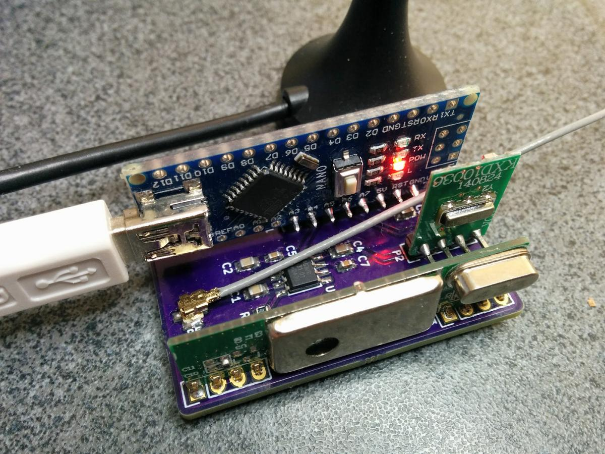

# Home Automation: MQTT <-> RF 433Mhz Bridge for switches and sensors.
This project implements a RF bridge for 433Mhz devices. The idea is to have a small AVR do the mod/demod and send diggested messages on it's serial port to a linux box for processing; in this case bridging sensors and switches to a MQTT broker.

This was made to interface my cheap RF433 gizmoz (wall switches, outlets, temperature sensors etc) to the home automation, and ultimately the Amazon echo/Alexa.

The fact the AVR does all the sensitive bits means the linux program doesn't eat a lot of CPU and can concentrate on the applicative parts, which is the MQTT bridging.

Finished Project (Minus case)

## The AVR Bits
The firmware can run on anything with about 2KB of SRAM (currently uses <1300 bytes), and a clock of 16Mhz. The firmware 'samples' the RF signal from the 433 module at about 64khz and tries to detect edges, then regular pulses, then does some decoding until a 'long low pulse', and forwards it on.

The firmware can also transmit (altho this part isn't finished, only ASK is working for now) using the same message format. The code doesn't try to be too clever and has a 'raw' mode it can be switches into to forward raw pulses straight to the host for analysis. 

The firmware is capable of decoding both Amplitude-Shift Keying (ASK) and manchester encoding. It's completely frequency/pattern independent and continuously search for signal in the noise before applying some filtering and hopefully forward the whole diggested message onward.

Also, I wanted to publish a firmware that looks marketedly different from the typical arduidiot[0] firmware that is all bloaty, synchronous and so on. This firmware uses coroutines, is completely asynchronous and allows the AVR to be in sleep mode most of the time. *This* is he way I do embedded; use a tick clock of any frequency (here, I use the sampling clock) and derivate everything else from it, and sleep in between ticks when you no longer need the CPU.

The only bit that is not synchronous to that tick mark is the UART, it's all interrupt driven, and it's nicely isolated using biggish FIFOs so it's unlikely to become blocking.

[0]: Arduidiot is my name for the well known boards. Since a few years back when they started suing each others for the name, I decided my version of the name was a lot more appropriate.

### Message format
A Typical message will be sent to the host like this, for a dumb switch:

    MA:40553300#19!3f*36

This is a message that already has been decoded as ASK encoding, has 0x19 bits, the clock duration was 0x2f timer clock cycle per bit, and the checksum was 0x36.

A more involved message would be:

    MM:0028b4206b0b38c0#40!3f*ff

This one has 'M'anchester encoding, 0x40 bits with 0x3f/2 timer ticks per bits.

The reason the timer clock is returned is to be able to reply the message back. Currently you can 'replay' ASK messages by just sending them back to the serial port. They will be replayed 3 times.

## The Linux Bits
The linux bit sits on the serial port, reads diggested messages and 'maps' them to MQTT messages. For dumb on/off switches it uses a file containing the mapping; but there is an extra decoder for the temperature/humidity sensor. The mapping is'nt terribly clever and use a flat file. 

The linux process uses libmosquitto to connect to a MQTT broker. I might try to do away with the libmosquitto requirement, as I don't think I need all the features (and footprint) it brings. I just need a unsecured connection to a broker, and let the broker be 'clever' and do encryption bridging if needs be.

The linux bit also subscribes to the mapped messages, and when it received a MQTT notification that hasn't been sent by itself, it just passes it on to the AVR board for transmisssions. That means you can have a Dashboard with switches, or use Amazon Alexa etc to send the messages on the RF link. No need for a web interface etc, just use MQTT. I personally use Node-Red to do the Alexa Logic bits.

The program can run on pretty much anything, it uses very very little resources, so a Raspberi Pi or anything else will work just fine!

## The Hardware Bits
Note: The hardware has [it's own page](kicad/README.md).

For prototyping I used an Arduino Mega and a RF433 receiver + transmitter. I ended up using 2 antennas separated by about 20cm on the prototype, it works, even if the receiver is a bit overwelmed for a little while after I transmit anything. It otherwises requires no extra hardware. The only thing I did was add a 100R resistor in series with the receiver output, as I was seeing a lot of ringing on the oscilloscope.

The 'real' hardware will be an Arduino nano v3.0 with an Atmega 328p. Powered via the USB port. I've designed a board using Kicad already, and the PCBs are on the way. https://oshpark.com/shared_projects/ZqEOBR2t
Hardware uses a NXP RF switch for sharing an antenna in half-duplex, and apart from a bit of filtering that's about it! More later.

