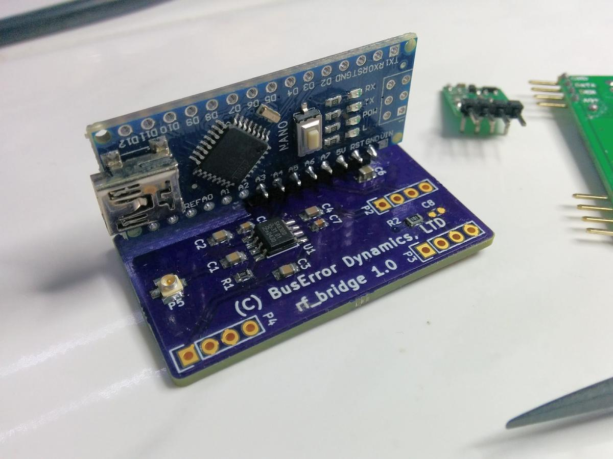

#Hardware: rf_bridge

Version 1.x of the hardware uses very little hardware. You need:

  * An Arduino with ~1.5KB SRAM and bout 6KB flash, and runs at least at 16Mhz.
  * A cheap 433Mhz receiver module
  * A cheap 433Mhz transmitter module

The pcb also has a RF switch to be able to share the antenna. The prototype didn't have that and used 2 17cm pieces of wire, and it worked just fine, so it's not *stricly* needed. The hardware here is made to be a neater small package with pigtail connector to a 'proper' antenna.

Finished Project

The PCB is very simple, the arduino I picked is a Nano, and it's mounted vertically with the 433 bits, so the result is quite compact.

Note the 90 Header is offset by <b>one pin</b>.

  * You can find the schematic as a [.PDF in this directory](rf_bridge_schematics.pdf). 
  * The PCB was ordered from OSHPark ($9 for 3) -- unfortunatelly I had to tweak a couple of things since, so I won't publish the 'share' link until the version 1.1 is tested.

##The BOM:

|Ref.|Value|Description
|----|-------|-----------------------|
|C1,C2,C3,
C4,C7|10nF|0603 Caps.|
|C5|100nF|0604 Cap|
|C6|4.7uF|0805 Capacitor (Optional)|
|C8|10pF|0603 Cap (Optional)|
|P1|Nano|Arduino. Use 90 headers. We only use a 8 section of them, and the headers are NOT soldered from the first pin, but from the pin marked 5V on the Nano.|
|P2|RF_TX|Both the TX and the RX comes from eBay.|
|P3,P4|RF_RX|[These](http://www.ebay.co.uk/itm/331805856615) are the exact modules I used|
|P5|U.FR|SMT 'pigtail' antenna Connector [Hirose U.FL](http://uk.farnell.com/hirose-hrs/u-fl-r-smt-1-10/rf-coaxial-u-fl-straight-jack/dp/1688077)|
|R1|10K|0603 Pulldown|
|R2|100|0603 Filtering, use anytime you like here even R0|
|U1|SA630|SOIC8. RF Antenna Switcher. [NXP SA630D](http://uk.farnell.com/nxp/sa630d-01-112/rf-switch-spdt-dc-1ghz-soic-8/dp/2400605) |

